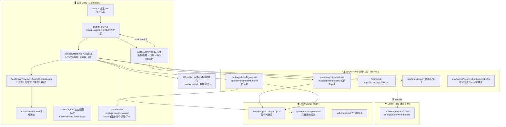
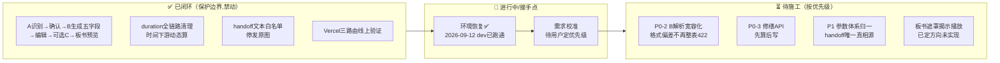

# 项目实时架构模块图

> 上下文入口 + 施工路线 + todolist + 项目节奏。施工索引的代码细节真相在 `doc/minimal-runtime-loop.md`，本文件只管"现在长什么样、修到哪、下一步干什么"。每次施工后必须更新本文件。

## 一、系统全景设计图（节点带关键词）

**跨层耦合警示**：server/ 反向 import src/ 5 处（prompt/contract/boardToolCatalog/stepHandoff/speechMarkdown）——Vercel 与本地共用合同的前提，改动需双向验证。

## 二、施工进展图

## 三、Todolist（按优先级）

| # | 事项 | 来源 | 风险 | 状态 |
|---|---|---|---|---|
| 1 | P0-2：B 输出解析宽容化（多回 notes/旧字段/动作偏差→降级而非 422） | KNOWN_ISSUES | 中（动 contract，三方复用） | ❌ |
| 2 | P0-3：修缮 API 先算后写，前端"应用"才落盘 | KNOWN_ISSUES | 低（有 revert 兜底） | ❌ |
| 3 | P1-1~P1-5：两套 canvasParams 归一，handoff 为唯一真相源；删 zones 死代码 | KNOWN_ISSUES | 高（动 4381 行主组件） | ❌ |
| 4 | Check Agent C 用真实付费 API 手动点一次验证 | PROJECT_STATE | 低 | ❌ |
| 5 | 板书"完整预排版+分步遮罩揭示"播放（方向已定） | PROJECT_STATE | 高（新能力，独立插件） | ❌ |
| 6 | 死代码清理：agentBV2ProxyPlugin.js(165行)、boardToolTiming.js、根目录两个孤立 html | 勘探 | 低（等用户确认再删） | ❌ |
| 7 | doc 疑似重复文件合并（self-check.md 损坏首行、中英混用知识清单） | 勘探 | 低 | ❌ |

## 四、项目节奏反馈

- **2026-09-12 接手**：电脑重置导致 PATH 全丢→已恢复 D:\env 运行时并写入用户环境变量；`npm install` 159 包成功；dev server（Vite v8.3.0）跑通 http://127.0.0.1:3000，首页/入口/三 API 路由验证 200/400(预期)。
- **接手体检结论**：主链闭环健康，回归锚点齐（`npm run build` + `check:proxy` + `check:knowledge`）；债务集中在 AgentBDirect.vue 巨石化（4381 行）与两套参数体系并存。
- **当前节奏**：阶段一勘探✅ → 阶段二需求校准（进行中）→ 待用户定向后进阶段三。
- **施工纪律提醒**：任何修改先更新本文件计划，改完跑最小回归三件套；一个问题错 5 次即熔断逆向。
